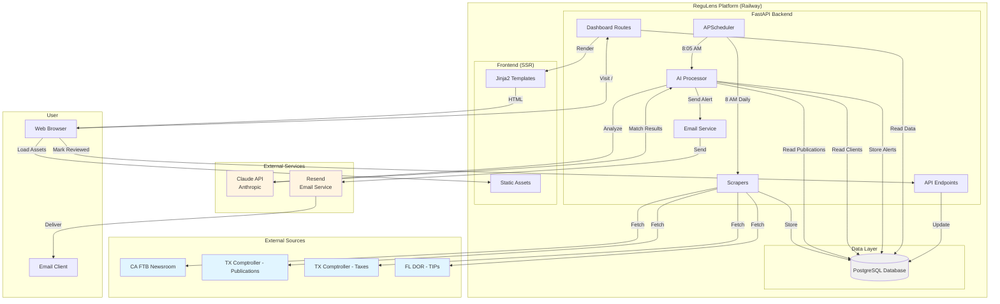
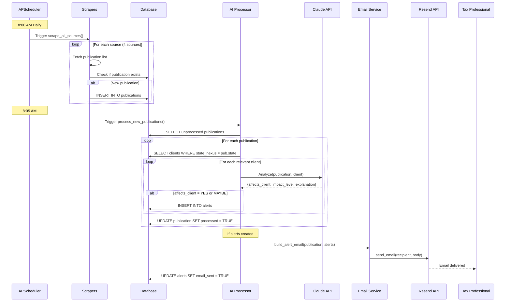
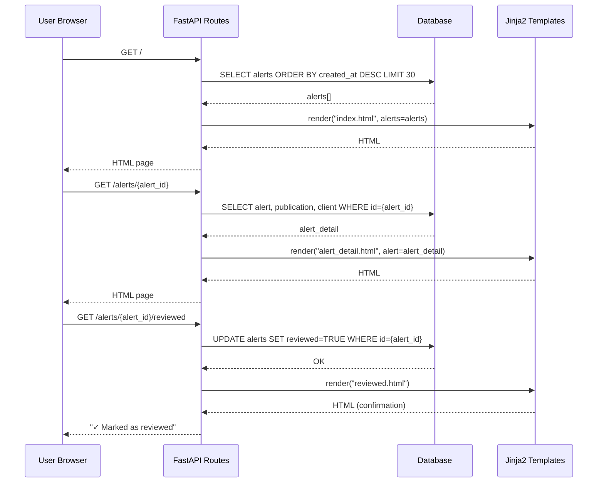
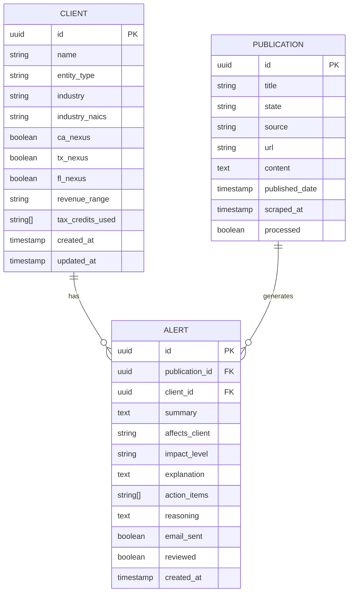

# ReguLens MVP - High-Level Design

**Version:** 1.0  
**Date:** 2026-04-29  
**Status:** Design Phase  

---

## Overview

ReguLens is an AI-powered regulatory monitoring system that automatically tracks tax regulations from government sources, matches them to client profiles using AI, and sends intelligent alerts.

**Core Value Proposition:** Eliminate the "manual discovery gap" - reduce time from regulation publication to client impact analysis from weeks to minutes.

---

## System Architecture

### Architecture Diagram



---

## Component Architecture

### 1. Data Collection Layer

**Components:**
- **Scrapers** (Python - Playwright + BeautifulSoup)
  - CA FTB Newsroom Scraper
  - TX Comptroller Publications Scraper
  - TX Comptroller Taxes Scraper
  - FL DOR TIPs Scraper

**Responsibility:**
- Fetch new publications from government websites daily
- Extract title, date, content, URL
- Detect changes (compare with previous scrapes)
- Store raw publication data in database

**Technology:**
- Playwright (JavaScript-heavy sites)
- BeautifulSoup4 (HTML parsing)
- APScheduler (cron jobs)

---

### 2. AI Processing Layer

**Components:**
- **AI Matcher** (Claude API integration)
- **Background Job Processor**

**Responsibility:**
- Read unprocessed publications from database
- Filter clients by state nexus (optimization)
- For each publication-client pair:
  - Call Claude API with publication text + client context
  - Parse AI response (JSON)
  - Determine if/how client is affected
- Create Alert records for matches
- Mark publications as processed

**Technology:**
- Anthropic Python SDK (async)
- Claude Sonnet 4 model

---

### 3. Notification Layer

**Components:**
- **Email Service** (Resend integration)
- **Email Template Builder**

**Responsibility:**
- Group alerts by publication
- Build email with:
  - Publication summary
  - List of affected clients
  - Impact levels per client
  - Action items
  - Magic links (view dashboard, mark reviewed)
- Send email to configured recipient
- Track email delivery status

**Technology:**
- Resend API (Python SDK)
- Jinja2 for email templates

---

### 4. Presentation Layer

**Components:**
- **Dashboard Routes** (FastAPI + Jinja2)
- **API Endpoints** (FastAPI)
- **Static Assets** (CSS, JS)

**Responsibility:**
- **Dashboard:**
  - Homepage: Alert feed (last 30 days)
  - Alert detail: Full publication + clients
  - Mark as reviewed action
- **API:**
  - Client list (read-only)
  - Publication list
  - Alert list
  - Magic link endpoints

**Technology:**
- FastAPI (routing, templating)
- Jinja2 (server-side rendering)
- Plain CSS or Tailwind CDN

---

### 5. Data Layer

**Components:**
- **PostgreSQL Database**
- **SQLAlchemy ORM**
- **Alembic Migrations**

**Responsibility:**
- Store clients, publications, alerts
- Maintain relationships
- Support complex queries (filtering, joins)
- Audit trail (timestamps)

**Technology:**
- PostgreSQL (Railway managed)
- SQLAlchemy (ORM)
- Alembic (migrations)

---

## Data Flow Diagrams

### Daily Automated Flow



---

### User Dashboard Flow



---

## Database Schema

### Entity Relationship Diagram



---

## Technology Stack Summary

### Backend
- **Language:** Python 3.11+
- **Framework:** FastAPI
- **ORM:** SQLAlchemy
- **Migrations:** Alembic
- **Async:** asyncio, aiohttp

### Frontend (Minimal Dashboard)
- **Templating:** Jinja2
- **CSS:** Plain CSS or Tailwind CDN
- **JavaScript:** Minimal (optional)

### Data
- **Database:** PostgreSQL
- **Hosting:** Railway (managed)

### External Services
- **AI:** Claude API (Anthropic)
- **Email:** Resend API
- **Deployment:** Railway

### Background Jobs
- **Scheduler:** APScheduler
- **Cron Schedule:** Daily at 8 AM

### Development
- **Dependency Management:** uv or poetry
- **Testing:** pytest (future)
- **Linting:** ruff (future)

---

## Deployment Architecture

### Railway Deployment

```
┌─────────────────────────────────────────────────────┐
│ Railway Service: regulens-mvp                       │
├─────────────────────────────────────────────────────┤
│                                                     │
│  ┌──────────────────────────────────────────┐     │
│  │ FastAPI Application                      │     │
│  │ - Web server (port 8000)                 │     │
│  │ - Dashboard routes                       │     │
│  │ - API endpoints                          │     │
│  │ - Background scheduler                   │     │
│  └──────────────────────────────────────────┘     │
│                                                     │
│  ┌──────────────────────────────────────────┐     │
│  │ PostgreSQL Database                      │     │
│  │ - Managed by Railway                     │     │
│  │ - Automatic backups                      │     │
│  └──────────────────────────────────────────┘     │
│                                                     │
│  Environment Variables:                             │
│  - DATABASE_URL                                     │
│  - ANTHROPIC_API_KEY                               │
│  - RESEND_API_KEY                                  │
│  - ALERT_RECIPIENT_EMAIL                           │
│                                                     │
└─────────────────────────────────────────────────────┘
         │                    │
         │                    │
    HTTPS (Web)          API Calls
         │                    │
         ▼                    ▼
    User Browser      External APIs
                      (Claude, Resend)
```

### Single Service Deployment

**Benefits:**
- ✅ Simpler deployment (one service)
- ✅ No CORS issues
- ✅ Shared database connection pool
- ✅ Background jobs run in same process
- ✅ Lower cost ($5-10/month)

**Considerations:**
- ⚠️ Scraper crashes could affect web server
- ⚠️ Need good error handling/isolation
- ⚠️ Monitor resource usage (CPU, memory)

---

## API Structure

### REST Endpoints

```
GET  /                           # Dashboard homepage (HTML)
GET  /alerts/{id}                # Alert detail page (HTML)
GET  /alerts/{id}/reviewed       # Mark as reviewed (magic link)

GET  /api/clients                # List all clients (JSON)
GET  /api/clients/{id}           # Get client details (JSON)

GET  /api/publications           # List publications (JSON)
GET  /api/publications/{id}      # Get publication details (JSON)

GET  /api/alerts                 # List alerts (JSON)
GET  /api/alerts/{id}            # Get alert details (JSON)

POST /api/scrape/trigger         # Manual scraper trigger (admin)
GET  /api/scraper/status         # Scraper status (admin)

GET  /static/css/style.css       # Static assets
GET  /static/favicon.ico         # Static assets
```

---

## Security Considerations

### MVP Security Approach

**What we HAVE:**
- ✅ HTTPS (Railway default)
- ✅ Environment variables for secrets
- ✅ SQL injection protection (SQLAlchemy ORM)
- ✅ UUID-based alert IDs (hard to guess)

**What we DON'T HAVE (V2):**
- ❌ User authentication (dashboard is public)
- ❌ Rate limiting
- ❌ Input validation/sanitization
- ❌ CSRF protection
- ❌ Encrypted client data

**Justification for MVP:**
- Dashboard shows no sensitive data (client codes only, no PII)
- Single internal user (not public product)
- Alert IDs are UUIDs (unguessable)
- No write operations from dashboard (read-only + mark reviewed)

**V2 Security Additions:**
- Add authentication (email/password or OAuth)
- Encrypt client names
- Add rate limiting
- Add CSRF tokens
- Add API authentication

---

## Scalability Considerations

### Current Design (MVP Scale)

**Capacity:**
- 100 clients
- 4 sources
- ~5-10 publications/week
- ~500 AI analyses/week

**Performance:**
- Database: <1% of Railway free tier
- Scraping: ~2 minutes/day
- AI processing: ~5-10 minutes/publication
- Email: <100 emails/month

### Future Scaling Paths

**When to scale:**
- 1,000+ clients
- 10+ sources
- 100+ publications/week
- Multiple users

**Scaling options:**

1. **Vertical scaling** (Railway - easy)
   - Upgrade to larger instance
   - More CPU/RAM for concurrent processing

2. **Horizontal scaling** (separate services)
   - Scraper service (dedicated)
   - API service (web/dashboard)
   - Worker service (AI processing)
   - Load balancer

3. **Database optimization**
   - Add indexes (publication.state, alert.created_at)
   - Partition alerts table by date
   - Read replicas for dashboard queries

4. **Caching layer**
   - Redis for dashboard stats
   - Cache AI results (same publication analyzed multiple times)

5. **Queue-based processing**
   - Replace APScheduler with Celery + Redis
   - Better for long-running AI tasks
   - Retry logic, monitoring

---

## Error Handling Strategy

### Scraper Failures

**Scenarios:**
- Website down (503, timeout)
- HTML structure changed
- Network issues

**Handling:**
- Retry 3 times with exponential backoff
- Log error with details
- Continue to next source (don't block others)
- Email admin if all retries fail

### AI Processing Failures

**Scenarios:**
- Claude API down
- Rate limit hit
- Invalid JSON response
- Timeout

**Handling:**
- Retry with exponential backoff
- Queue publication for reprocessing
- Log error with publication ID
- Alert admin if persistent failures

### Email Delivery Failures

**Scenarios:**
- Resend API down
- Invalid recipient email
- Rate limit

**Handling:**
- Retry 3 times
- Mark alerts as email_sent=False
- Log for manual review
- Dashboard still shows alerts (fallback)

---

## Monitoring & Observability

### MVP Monitoring (Minimal)

**What to track:**
- Scraper success/failure (log file)
- Publications scraped per day (database count)
- Alerts generated per day (database count)
- Email delivery status (Resend dashboard)

**How:**
- FastAPI logging to stdout (Railway logs)
- Database queries for metrics
- Manual checks daily

### V2 Monitoring (Production)

**Add:**
- Sentry (error tracking)
- DataDog or New Relic (APM)
- Uptime monitoring (UptimeRobot)
- Custom dashboard (Grafana)
- Alerting (PagerDuty)

---

## Development Workflow

### Local Development

```bash
# 1. Setup virtual environment
uv venv
source .venv/bin/activate  # or .venv\Scripts\activate on Windows

# 2. Install dependencies
uv pip install -r requirements.txt

# 3. Setup environment variables
cp .env.example .env
# Edit .env with local PostgreSQL, API keys

# 4. Run database migrations
alembic upgrade head

# 5. Import client data
python scripts/import_clients.py

# 6. Start FastAPI server
uvicorn app.main:app --reload

# 7. Access dashboard
# http://localhost:8000
```

### Testing Strategy (V2)

```
tests/
  ├── test_scrapers.py       # Test scrapers with mock HTML
  ├── test_ai_matcher.py     # Test AI with mock Claude responses
  ├── test_email.py          # Test email formatting
  └── test_api.py            # Test API endpoints
```

---

## File Structure (Detailed)

```
ReguLens/
├── backend/
│   ├── app/
│   │   ├── __init__.py
│   │   ├── main.py                   # FastAPI app, startup/shutdown
│   │   ├── config.py                 # Settings (Pydantic BaseSettings)
│   │   ├── database.py               # DB connection, session
│   │   ├── dependencies.py           # FastAPI dependencies (Jinja2)
│   │   │
│   │   ├── models/                   # SQLAlchemy models
│   │   │   ├── __init__.py
│   │   │   ├── base.py               # Base class
│   │   │   ├── client.py
│   │   │   ├── publication.py
│   │   │   └── alert.py
│   │   │
│   │   ├── schemas/                  # Pydantic schemas (validation)
│   │   │   ├── __init__.py
│   │   │   ├── client.py
│   │   │   ├── publication.py
│   │   │   └── alert.py
│   │   │
│   │   ├── api/                      # API routes (JSON)
│   │   │   ├── __init__.py
│   │   │   ├── clients.py
│   │   │   ├── publications.py
│   │   │   └── alerts.py
│   │   │
│   │   ├── routes/                   # Dashboard routes (HTML)
│   │   │   ├── __init__.py
│   │   │   ├── dashboard.py          # /, /alerts/{id}
│   │   │   └── actions.py            # Magic links
│   │   │
│   │   ├── scrapers/                 # Web scrapers
│   │   │   ├── __init__.py
│   │   │   ├── base.py               # BaseScraper class
│   │   │   ├── ca_ftb_newsroom.py
│   │   │   ├── tx_comptroller_pubs.py
│   │   │   ├── tx_comptroller_tax.py
│   │   │   └── fl_dor_tips.py
│   │   │
│   │   ├── ai/                       # AI/LLM integration
│   │   │   ├── __init__.py
│   │   │   ├── matcher.py            # Match publication to client
│   │   │   └── prompts.py            # Prompt templates
│   │   │
│   │   ├── jobs/                     # Background jobs
│   │   │   ├── __init__.py
│   │   │   ├── scheduler.py          # APScheduler setup
│   │   │   ├── scrape_job.py         # Daily scraping
│   │   │   └── process_job.py        # AI processing
│   │   │
│   │   └── utils/                    # Utilities
│   │       ├── __init__.py
│   │       ├── email.py              # Email sending
│   │       └── formatting.py         # Email templates
│   │
│   ├── templates/                    # Jinja2 HTML templates
│   │   ├── base.html                 # Base layout
│   │   ├── index.html                # Alerts feed
│   │   ├── alert_detail.html         # Alert details
│   │   └── reviewed.html             # Confirmation page
│   │
│   ├── static/                       # Static assets
│   │   ├── css/
│   │   │   └── style.css
│   │   ├── js/
│   │   │   └── main.js
│   │   └── favicon.ico
│   │
│   ├── alembic/                      # Database migrations
│   │   ├── versions/
│   │   ├── env.py
│   │   └── alembic.ini
│   │
│   ├── tests/                        # Tests (V2)
│   │   └── ...
│   │
│   ├── requirements.txt              # Python dependencies
│   └── pyproject.toml                # Project metadata (uv/poetry)
│
├── scripts/
│   └── import_clients.py             # CSV import script
│
├── data/
│   └── sample/
│       └── client_profiles_mvp.csv   # 100 client profiles
│
├── docs/
│   ├── MVP-PLAN.md                   # MVP implementation plan
│   ├── RESEARCH-NOTES.md             # Research findings
│   ├── ARCHITECTURE.md               # This document
│   └── archive/
│
├── .env.example                      # Environment variables template
├── .env                              # Actual config (gitignored)
├── .gitignore
└── README.md
```

---

## Next Steps

1. **Week 1:** Setup FastAPI project structure matching this design
2. **Week 1:** Implement database models and migrations
3. **Week 1:** Build CSV import script
4. **Week 2:** Implement scrapers following base class design
5. **Week 3:** Integrate Claude API with matcher pattern
6. **Week 3:** Build minimal dashboard with Jinja2
7. **Week 4:** Deploy to Railway and test end-to-end

---

**Document Version:** 1.0  
**Last Updated:** 2026-04-29  
**Next Review:** After Week 1 implementation
